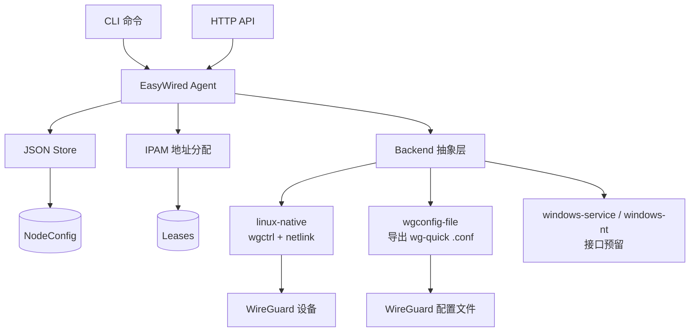
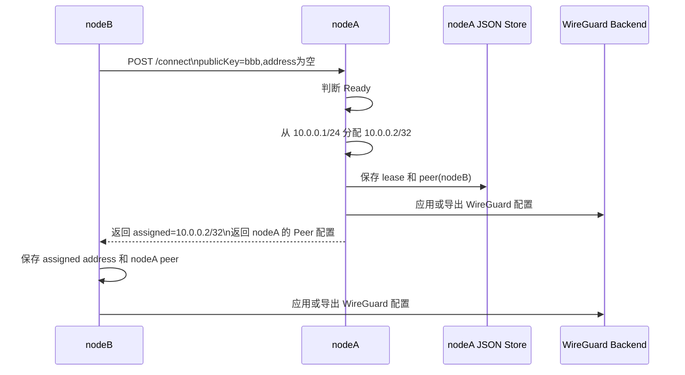
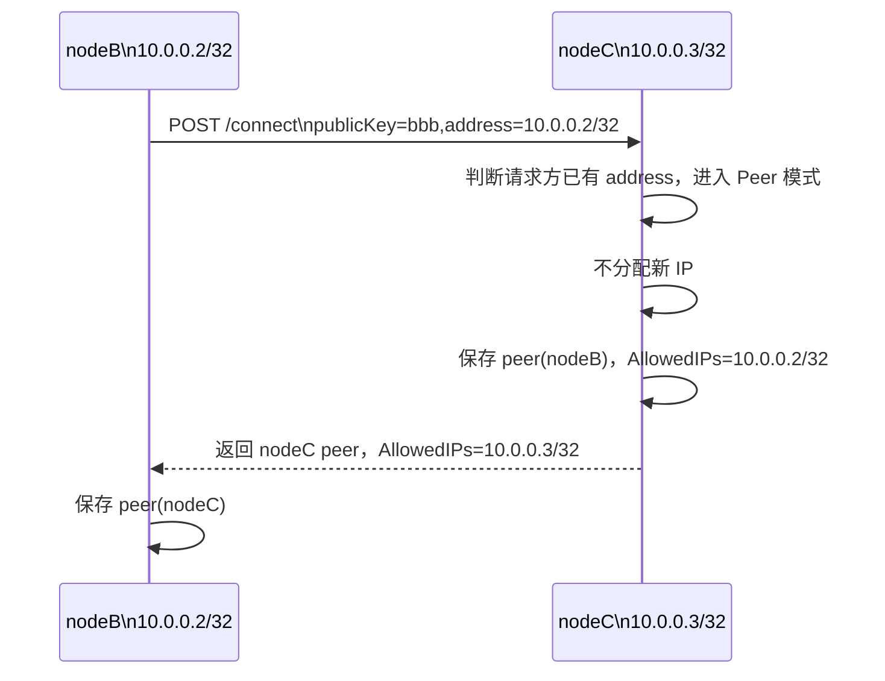
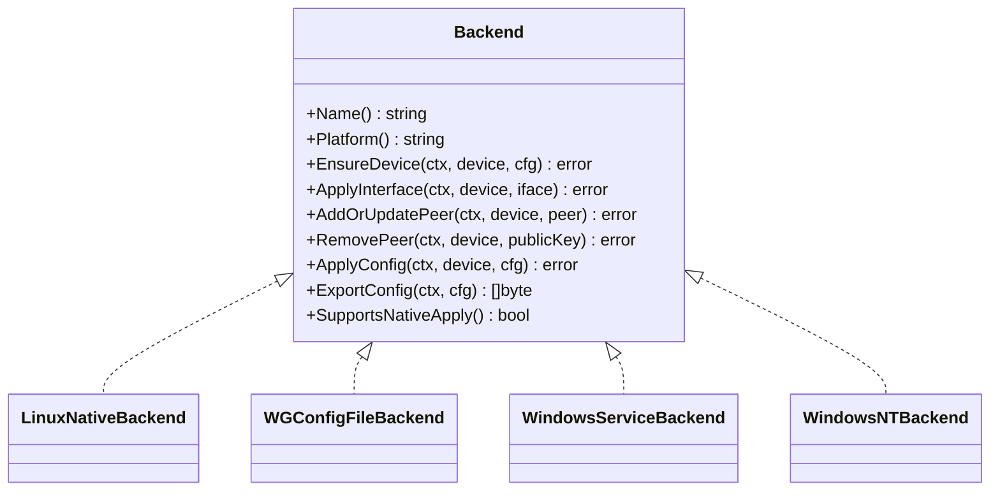

# EasyWired

## 项目解决的事情

EasyWired 是一个运行在各节点上的 WireGuard 控制面 Agent，用来自动完成节点接入、Peer 信息交换、WireGuard 内网 IP 分配、Peer 查询、断开连接、配置持久化和 WireGuard 配置生成/应用。

它不修改 WireGuard 协议，也不实现新的 VPN 协议；数据面仍由官方 WireGuard 负责，EasyWired 只负责控制面编排。

适合的场景：先让新节点连接一个可达节点，拿到内网地址和 Peer 配置；之后节点之间可以通过 WireGuard 内网地址继续互相发现和建立 Peer。

## 项目使用方法

构建：

```powershell
go build ./cmd
```

启动一个可分配地址的节点：

```powershell
.\cmd.exe serve --config examples/nodeA.json --device wg0 --listen :8080 --backend auto --output nodeA-wg0.conf
```
新节点连接到 nodeA：

```powershell
.\cmd.exe connect --config examples/nodeB.json --device wg0 --url http://nodeA:8080/connect --backend auto --output nodeB-wg0.conf
```

查询远端 Peer：

```powershell
.\cmd.exe peers --url http://nodeA:8080/peers
```

断开 Peer：

```powershell
.\cmd.exe disconnect --config examples/nodeB.json --device wg0 --url http://nodeA:8080/disconnect --public-key <peer-public-key> --backend auto --output nodeB-wg0.conf
```

只导出 WireGuard 配置：

```powershell
.\cmd.exe export --config examples/nodeB.json --output nodeB-wg0.conf
```
Backend 选择：

- `auto`：Linux 默认 `linux-native`，其他平台默认 `wgconfig-file`
- `wgconfig-file`：只生成标准 WireGuard `.conf`
- `linux-native`：Linux 下通过 `wgctrl` 和 `netlink` 应用配置
- `windows-service` / `windows-nt`：Windows native 接口已预留，当前 native apply 返回未实现

## 项目的技术原理

### 整个 Agent 的流程

每个节点都运行一个 Agent，并维护本地 JSON 状态：

```text
NodeConfig = NodeID + Interface + Peers + ExtField + Leases
```

- `Interface`：本节点 WireGuard 接口信息
- `Peers`：本节点已经认识的 WireGuard Peer
- `ExtField`：推荐给对方连接本节点时使用的元数据
- `Leases`：Join 模式下已经分配出去的内网 IP



Agent 的核心思想是：控制面负责“发现、交换、分配、持久化”，数据面仍然交给 WireGuard。

```text
控制面 = HTTP API + Store + IPAM + Backend 编排
数据面 = WireGuard 原生隧道
```

### Join 模式示例

假设 `nodeA` 已经有地址 `10.0.0.1/24`，`nodeB` 只有公钥，还没有 WireGuard 内网地址。



IP 分配公式可以理解为：

```text
available_ips = cidr_hosts(interface.address)
              - {network, broadcast, self_ip}
              - peer_allowed_ips
              - leased_ips

assigned_ip = min(available_ips)
```

所以当 `nodeA = 10.0.0.1/24` 时，第一次 Join 通常得到：

```text
nodeB => 10.0.0.2/32
nodeC => 10.0.0.3/32
```

### Peer 模式示例

当 `nodeB` 和 `nodeC` 都已经通过 `nodeA` 获得地址后，它们可以通过 WireGuard 内网互相连接。



Peer 模式的路由规则固定为：

```text
AllowedIPs(peer-mode) = peer.address/32
```

这样不会把 `0.0.0.0/0` 或大网段路由下发给普通 Peer，避免多个 Peer 之间出现 WireGuard 路由冲突。

### Backend 抽象



Linux 下可以通过 `linux-native` 直接配置 WireGuard；其他平台初版默认使用 `wgconfig-file` 生成标准 `.conf`，再交给官方 WireGuard 客户端导入。Windows native 接口已预留，但当前不直接调用系统 WireGuard 服务。

因此跨平台控制面逻辑保持一致，平台差异集中在 backend 中。
