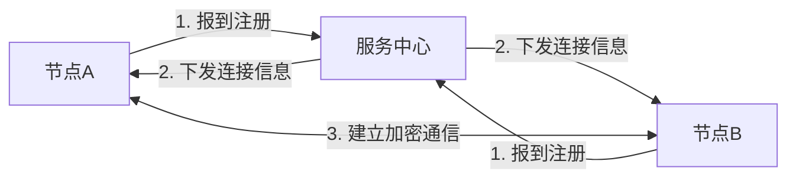
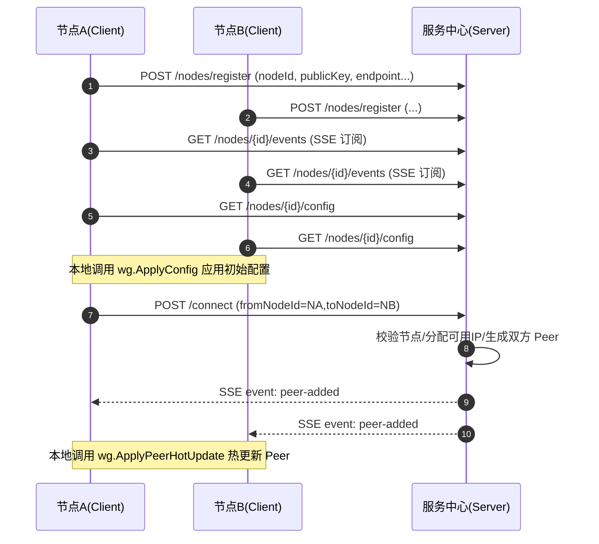

# EasyWired

一个为方便 WireGuard 节点之间配置分发的工具。通过提供中心服务，让节点启动后自动注册，服务中心统一管理节点并分发连接信息，帮助节点之间快速建立加密通信，省去了手动配置和分发的过程。

## 功能特点
- 自动节点注册：节点启动后自动上报 `nodeId`、公钥、地址等信息。
- 统一节点清单：可通过接口或命令查看已注册节点。
- 节点互联编排：服务中心可把两个节点配对并生成双方 Peer 信息。
- 动态配置下发：节点通过 SSE 接收 `peer-added` 事件并热更新 WireGuard Peer。
- 地址自动分配：连接时按目标节点网段自动分配可用 IPv4 地址。

## 功能概览

## 接口流程

